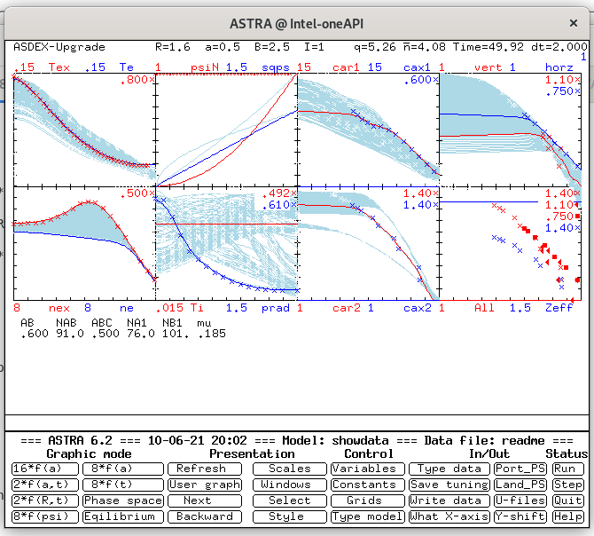

# ASTRA v. 6.2.1 

#### Installation guide for Ubuntu

1. Install [Intel® Fortran Compiler(Beta)](https://software.intel.com/content/www/us/en/develop/articles/oneapi-standalone-components.html#fortran) and  [Intel® C++ Compiler Classic](https://software.intel.com/content/www/us/en/develop/articles/oneapi-standalone-components.html#inpage-nav-5-undefined)

2. Install libx11-dev (because it is necessary XLib.h)
   ```
   sudo apt-get install libx11-dev
   ```
   
3. set env var for Intel OneApi

   ```
   source ~/intel/oneapi/setvars.sh
   ```
   
4. Check fortran and C compilers
   
   ```
   $ ifort -v
   ifort version 2021.2.0
   $ icc -v
   icc version 2021.2.0 (gcc version 9.3.0 compatibility)
   ```
   
5. Clone ASTRA Rep

   ```
   git clone git@github.com:temper8/ASTRA_6.git
   ```

   

6. Compile Astra kernel

   ```
   ./MAKER Astra  Intel-oneAPI
   ```

7. Create user profile
   ```
   ./MAUSER , a4 Intel-oneAPI
   ```

8. Run Astra

   ```
   ./a4/.exe/astra readme showdata
   ```

And you will see:



#### Installation guide for Windows

1. Install [Cygwin](https://www.cygwin.com/)

